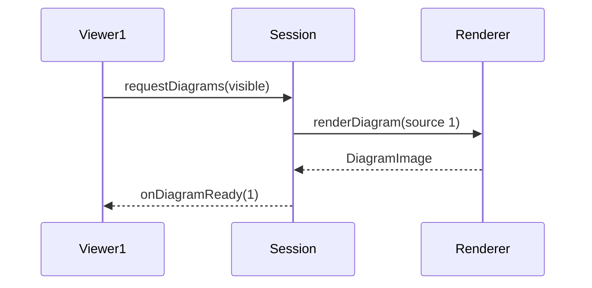
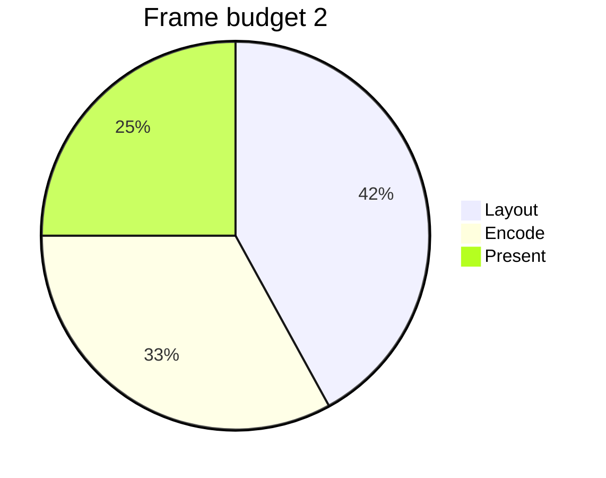
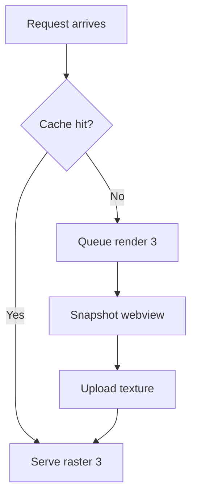
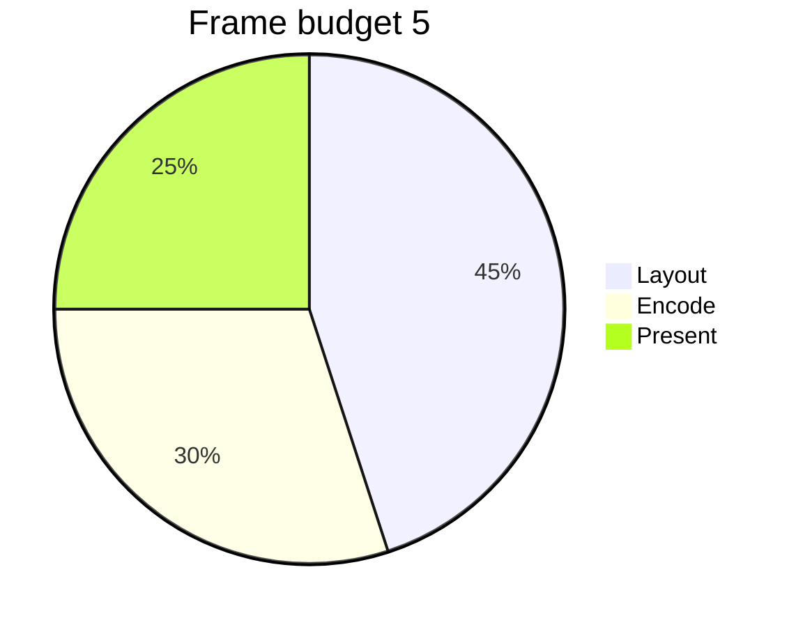
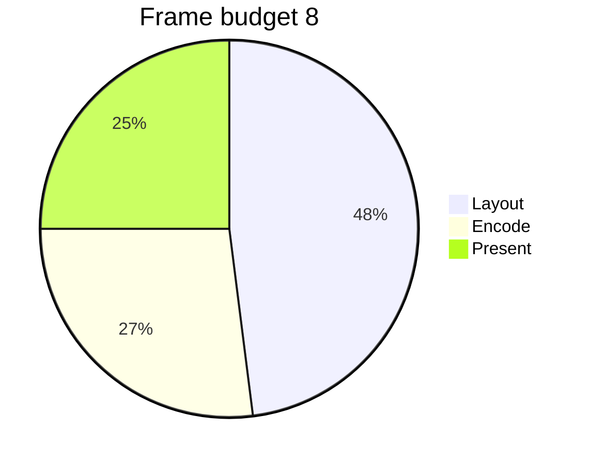
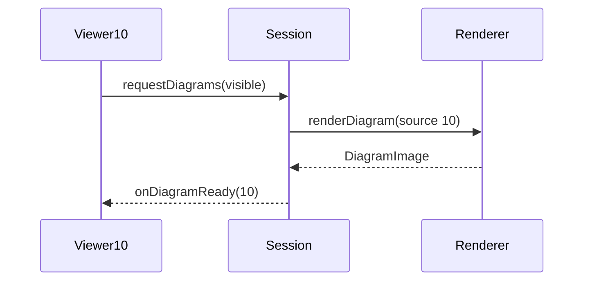
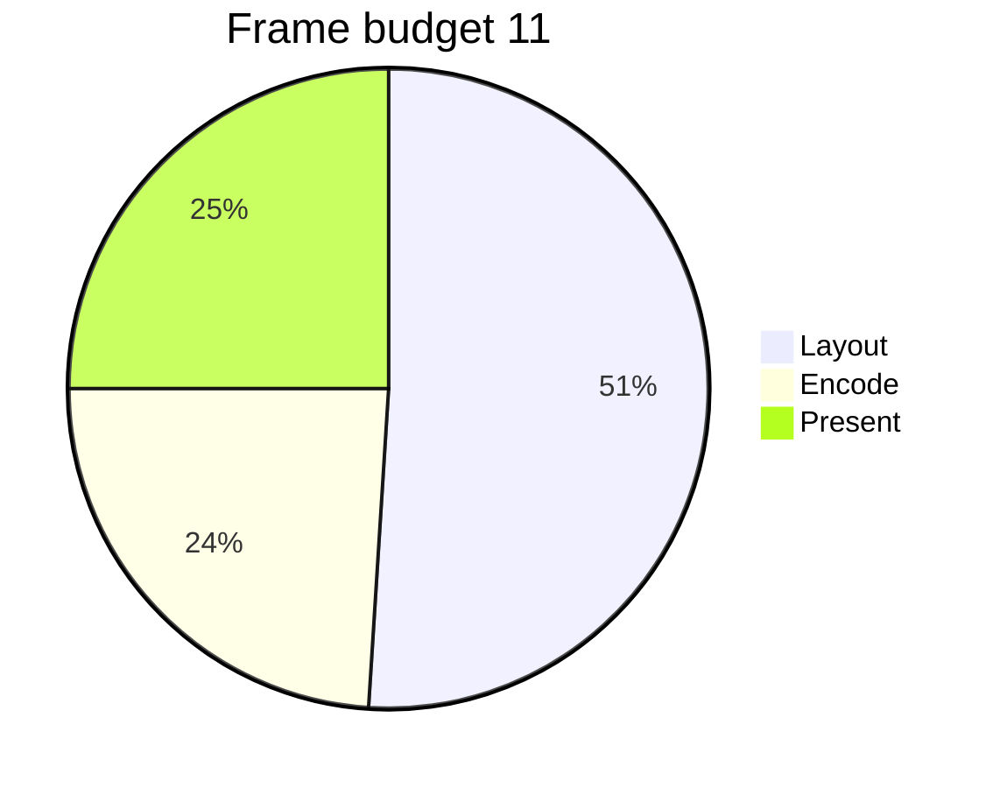

# Mermaid-heavy corpus

Deterministic fixture for the perf gate: mermaid fences must lay out as skeletons with zero rasterization cost on the first-paint path.


## Section 0

The renderer keeps the skeleton on glass until the raster lands; the anchored swap means content never jumps while you read. Each diagram below exercises the pending-diagram path at first paint — the gate holds this corpus to the same first-pixel ceiling as plain markdown, which is the whole point: diagram work must never buy its pixels with launch latency. The renderer keeps the skeleton on glass until the raster lands; the anchored swap means content never jumps while you read. Each diagram below exercises the pending-diagram path at first paint — the gate holds this corpus to the same first-pixel ceiling as plain markdown, which is the whole point: diagram work must never buy its pixels with launch latency. The renderer keeps the skeleton on glass until the raster lands; the anchored swap means content never jumps while you read. Each diagram below exercises the pending-diagram path at first paint — the gate holds this corpus to the same first-pixel ceiling as plain markdown, which is the whole point: diagram work must never buy its pixels with launch latency. 


Interleaved prose keeps block shapes realistic. The renderer keeps the skeleton on glass until the raster lands; the anchored swap means content never jumps while you read. Each diagram below exercises the pending-diagram path at first paint — the gate holds this corpus to the same first-pixel ceiling as plain markdown, which is the whole point: diagram work must never buy its pixels with launch latency. 

```swift
func measure0() -> Double {
    let start = CACurrentMediaTime()
    defer { record(CACurrentMediaTime() - start, slot: 0) }
    return layout.prepare(docRange: visible, anchorY: top)
}
```


## Section 1

The renderer keeps the skeleton on glass until the raster lands; the anchored swap means content never jumps while you read. Each diagram below exercises the pending-diagram path at first paint — the gate holds this corpus to the same first-pixel ceiling as plain markdown, which is the whole point: diagram work must never buy its pixels with launch latency. The renderer keeps the skeleton on glass until the raster lands; the anchored swap means content never jumps while you read. Each diagram below exercises the pending-diagram path at first paint — the gate holds this corpus to the same first-pixel ceiling as plain markdown, which is the whole point: diagram work must never buy its pixels with launch latency. The renderer keeps the skeleton on glass until the raster lands; the anchored swap means content never jumps while you read. Each diagram below exercises the pending-diagram path at first paint — the gate holds this corpus to the same first-pixel ceiling as plain markdown, which is the whole point: diagram work must never buy its pixels with launch latency. 



Interleaved prose keeps block shapes realistic. The renderer keeps the skeleton on glass until the raster lands; the anchored swap means content never jumps while you read. Each diagram below exercises the pending-diagram path at first paint — the gate holds this corpus to the same first-pixel ceiling as plain markdown, which is the whole point: diagram work must never buy its pixels with launch latency. 

```swift
func measure1() -> Double {
    let start = CACurrentMediaTime()
    defer { record(CACurrentMediaTime() - start, slot: 1) }
    return layout.prepare(docRange: visible, anchorY: top)
}
```


## Section 2

The renderer keeps the skeleton on glass until the raster lands; the anchored swap means content never jumps while you read. Each diagram below exercises the pending-diagram path at first paint — the gate holds this corpus to the same first-pixel ceiling as plain markdown, which is the whole point: diagram work must never buy its pixels with launch latency. The renderer keeps the skeleton on glass until the raster lands; the anchored swap means content never jumps while you read. Each diagram below exercises the pending-diagram path at first paint — the gate holds this corpus to the same first-pixel ceiling as plain markdown, which is the whole point: diagram work must never buy its pixels with launch latency. The renderer keeps the skeleton on glass until the raster lands; the anchored swap means content never jumps while you read. Each diagram below exercises the pending-diagram path at first paint — the gate holds this corpus to the same first-pixel ceiling as plain markdown, which is the whole point: diagram work must never buy its pixels with launch latency. 



Interleaved prose keeps block shapes realistic. The renderer keeps the skeleton on glass until the raster lands; the anchored swap means content never jumps while you read. Each diagram below exercises the pending-diagram path at first paint — the gate holds this corpus to the same first-pixel ceiling as plain markdown, which is the whole point: diagram work must never buy its pixels with launch latency. 

```swift
func measure2() -> Double {
    let start = CACurrentMediaTime()
    defer { record(CACurrentMediaTime() - start, slot: 2) }
    return layout.prepare(docRange: visible, anchorY: top)
}
```


## Section 3

The renderer keeps the skeleton on glass until the raster lands; the anchored swap means content never jumps while you read. Each diagram below exercises the pending-diagram path at first paint — the gate holds this corpus to the same first-pixel ceiling as plain markdown, which is the whole point: diagram work must never buy its pixels with launch latency. The renderer keeps the skeleton on glass until the raster lands; the anchored swap means content never jumps while you read. Each diagram below exercises the pending-diagram path at first paint — the gate holds this corpus to the same first-pixel ceiling as plain markdown, which is the whole point: diagram work must never buy its pixels with launch latency. The renderer keeps the skeleton on glass until the raster lands; the anchored swap means content never jumps while you read. Each diagram below exercises the pending-diagram path at first paint — the gate holds this corpus to the same first-pixel ceiling as plain markdown, which is the whole point: diagram work must never buy its pixels with launch latency. 



Interleaved prose keeps block shapes realistic. The renderer keeps the skeleton on glass until the raster lands; the anchored swap means content never jumps while you read. Each diagram below exercises the pending-diagram path at first paint — the gate holds this corpus to the same first-pixel ceiling as plain markdown, which is the whole point: diagram work must never buy its pixels with launch latency. 

```swift
func measure3() -> Double {
    let start = CACurrentMediaTime()
    defer { record(CACurrentMediaTime() - start, slot: 3) }
    return layout.prepare(docRange: visible, anchorY: top)
}
```


## Section 4

The renderer keeps the skeleton on glass until the raster lands; the anchored swap means content never jumps while you read. Each diagram below exercises the pending-diagram path at first paint — the gate holds this corpus to the same first-pixel ceiling as plain markdown, which is the whole point: diagram work must never buy its pixels with launch latency. The renderer keeps the skeleton on glass until the raster lands; the anchored swap means content never jumps while you read. Each diagram below exercises the pending-diagram path at first paint — the gate holds this corpus to the same first-pixel ceiling as plain markdown, which is the whole point: diagram work must never buy its pixels with launch latency. The renderer keeps the skeleton on glass until the raster lands; the anchored swap means content never jumps while you read. Each diagram below exercises the pending-diagram path at first paint — the gate holds this corpus to the same first-pixel ceiling as plain markdown, which is the whole point: diagram work must never buy its pixels with launch latency. 


Interleaved prose keeps block shapes realistic. The renderer keeps the skeleton on glass until the raster lands; the anchored swap means content never jumps while you read. Each diagram below exercises the pending-diagram path at first paint — the gate holds this corpus to the same first-pixel ceiling as plain markdown, which is the whole point: diagram work must never buy its pixels with launch latency. 

```swift
func measure4() -> Double {
    let start = CACurrentMediaTime()
    defer { record(CACurrentMediaTime() - start, slot: 4) }
    return layout.prepare(docRange: visible, anchorY: top)
}
```


## Section 5

The renderer keeps the skeleton on glass until the raster lands; the anchored swap means content never jumps while you read. Each diagram below exercises the pending-diagram path at first paint — the gate holds this corpus to the same first-pixel ceiling as plain markdown, which is the whole point: diagram work must never buy its pixels with launch latency. The renderer keeps the skeleton on glass until the raster lands; the anchored swap means content never jumps while you read. Each diagram below exercises the pending-diagram path at first paint — the gate holds this corpus to the same first-pixel ceiling as plain markdown, which is the whole point: diagram work must never buy its pixels with launch latency. The renderer keeps the skeleton on glass until the raster lands; the anchored swap means content never jumps while you read. Each diagram below exercises the pending-diagram path at first paint — the gate holds this corpus to the same first-pixel ceiling as plain markdown, which is the whole point: diagram work must never buy its pixels with launch latency. 



Interleaved prose keeps block shapes realistic. The renderer keeps the skeleton on glass until the raster lands; the anchored swap means content never jumps while you read. Each diagram below exercises the pending-diagram path at first paint — the gate holds this corpus to the same first-pixel ceiling as plain markdown, which is the whole point: diagram work must never buy its pixels with launch latency. 

```swift
func measure5() -> Double {
    let start = CACurrentMediaTime()
    defer { record(CACurrentMediaTime() - start, slot: 5) }
    return layout.prepare(docRange: visible, anchorY: top)
}
```


## Section 6

The renderer keeps the skeleton on glass until the raster lands; the anchored swap means content never jumps while you read. Each diagram below exercises the pending-diagram path at first paint — the gate holds this corpus to the same first-pixel ceiling as plain markdown, which is the whole point: diagram work must never buy its pixels with launch latency. The renderer keeps the skeleton on glass until the raster lands; the anchored swap means content never jumps while you read. Each diagram below exercises the pending-diagram path at first paint — the gate holds this corpus to the same first-pixel ceiling as plain markdown, which is the whole point: diagram work must never buy its pixels with launch latency. The renderer keeps the skeleton on glass until the raster lands; the anchored swap means content never jumps while you read. Each diagram below exercises the pending-diagram path at first paint — the gate holds this corpus to the same first-pixel ceiling as plain markdown, which is the whole point: diagram work must never buy its pixels with launch latency. 


Interleaved prose keeps block shapes realistic. The renderer keeps the skeleton on glass until the raster lands; the anchored swap means content never jumps while you read. Each diagram below exercises the pending-diagram path at first paint — the gate holds this corpus to the same first-pixel ceiling as plain markdown, which is the whole point: diagram work must never buy its pixels with launch latency. 

```swift
func measure6() -> Double {
    let start = CACurrentMediaTime()
    defer { record(CACurrentMediaTime() - start, slot: 6) }
    return layout.prepare(docRange: visible, anchorY: top)
}
```


## Section 7

The renderer keeps the skeleton on glass until the raster lands; the anchored swap means content never jumps while you read. Each diagram below exercises the pending-diagram path at first paint — the gate holds this corpus to the same first-pixel ceiling as plain markdown, which is the whole point: diagram work must never buy its pixels with launch latency. The renderer keeps the skeleton on glass until the raster lands; the anchored swap means content never jumps while you read. Each diagram below exercises the pending-diagram path at first paint — the gate holds this corpus to the same first-pixel ceiling as plain markdown, which is the whole point: diagram work must never buy its pixels with launch latency. The renderer keeps the skeleton on glass until the raster lands; the anchored swap means content never jumps while you read. Each diagram below exercises the pending-diagram path at first paint — the gate holds this corpus to the same first-pixel ceiling as plain markdown, which is the whole point: diagram work must never buy its pixels with launch latency. 


Interleaved prose keeps block shapes realistic. The renderer keeps the skeleton on glass until the raster lands; the anchored swap means content never jumps while you read. Each diagram below exercises the pending-diagram path at first paint — the gate holds this corpus to the same first-pixel ceiling as plain markdown, which is the whole point: diagram work must never buy its pixels with launch latency. 

```swift
func measure7() -> Double {
    let start = CACurrentMediaTime()
    defer { record(CACurrentMediaTime() - start, slot: 7) }
    return layout.prepare(docRange: visible, anchorY: top)
}
```


## Section 8

The renderer keeps the skeleton on glass until the raster lands; the anchored swap means content never jumps while you read. Each diagram below exercises the pending-diagram path at first paint — the gate holds this corpus to the same first-pixel ceiling as plain markdown, which is the whole point: diagram work must never buy its pixels with launch latency. The renderer keeps the skeleton on glass until the raster lands; the anchored swap means content never jumps while you read. Each diagram below exercises the pending-diagram path at first paint — the gate holds this corpus to the same first-pixel ceiling as plain markdown, which is the whole point: diagram work must never buy its pixels with launch latency. The renderer keeps the skeleton on glass until the raster lands; the anchored swap means content never jumps while you read. Each diagram below exercises the pending-diagram path at first paint — the gate holds this corpus to the same first-pixel ceiling as plain markdown, which is the whole point: diagram work must never buy its pixels with launch latency. 



Interleaved prose keeps block shapes realistic. The renderer keeps the skeleton on glass until the raster lands; the anchored swap means content never jumps while you read. Each diagram below exercises the pending-diagram path at first paint — the gate holds this corpus to the same first-pixel ceiling as plain markdown, which is the whole point: diagram work must never buy its pixels with launch latency. 

```swift
func measure8() -> Double {
    let start = CACurrentMediaTime()
    defer { record(CACurrentMediaTime() - start, slot: 8) }
    return layout.prepare(docRange: visible, anchorY: top)
}
```


## Section 9

The renderer keeps the skeleton on glass until the raster lands; the anchored swap means content never jumps while you read. Each diagram below exercises the pending-diagram path at first paint — the gate holds this corpus to the same first-pixel ceiling as plain markdown, which is the whole point: diagram work must never buy its pixels with launch latency. The renderer keeps the skeleton on glass until the raster lands; the anchored swap means content never jumps while you read. Each diagram below exercises the pending-diagram path at first paint — the gate holds this corpus to the same first-pixel ceiling as plain markdown, which is the whole point: diagram work must never buy its pixels with launch latency. The renderer keeps the skeleton on glass until the raster lands; the anchored swap means content never jumps while you read. Each diagram below exercises the pending-diagram path at first paint — the gate holds this corpus to the same first-pixel ceiling as plain markdown, which is the whole point: diagram work must never buy its pixels with launch latency. 


Interleaved prose keeps block shapes realistic. The renderer keeps the skeleton on glass until the raster lands; the anchored swap means content never jumps while you read. Each diagram below exercises the pending-diagram path at first paint — the gate holds this corpus to the same first-pixel ceiling as plain markdown, which is the whole point: diagram work must never buy its pixels with launch latency. 

```swift
func measure9() -> Double {
    let start = CACurrentMediaTime()
    defer { record(CACurrentMediaTime() - start, slot: 9) }
    return layout.prepare(docRange: visible, anchorY: top)
}
```


## Section 10

The renderer keeps the skeleton on glass until the raster lands; the anchored swap means content never jumps while you read. Each diagram below exercises the pending-diagram path at first paint — the gate holds this corpus to the same first-pixel ceiling as plain markdown, which is the whole point: diagram work must never buy its pixels with launch latency. The renderer keeps the skeleton on glass until the raster lands; the anchored swap means content never jumps while you read. Each diagram below exercises the pending-diagram path at first paint — the gate holds this corpus to the same first-pixel ceiling as plain markdown, which is the whole point: diagram work must never buy its pixels with launch latency. The renderer keeps the skeleton on glass until the raster lands; the anchored swap means content never jumps while you read. Each diagram below exercises the pending-diagram path at first paint — the gate holds this corpus to the same first-pixel ceiling as plain markdown, which is the whole point: diagram work must never buy its pixels with launch latency. 



Interleaved prose keeps block shapes realistic. The renderer keeps the skeleton on glass until the raster lands; the anchored swap means content never jumps while you read. Each diagram below exercises the pending-diagram path at first paint — the gate holds this corpus to the same first-pixel ceiling as plain markdown, which is the whole point: diagram work must never buy its pixels with launch latency. 

```swift
func measure10() -> Double {
    let start = CACurrentMediaTime()
    defer { record(CACurrentMediaTime() - start, slot: 10) }
    return layout.prepare(docRange: visible, anchorY: top)
}
```


## Section 11

The renderer keeps the skeleton on glass until the raster lands; the anchored swap means content never jumps while you read. Each diagram below exercises the pending-diagram path at first paint — the gate holds this corpus to the same first-pixel ceiling as plain markdown, which is the whole point: diagram work must never buy its pixels with launch latency. The renderer keeps the skeleton on glass until the raster lands; the anchored swap means content never jumps while you read. Each diagram below exercises the pending-diagram path at first paint — the gate holds this corpus to the same first-pixel ceiling as plain markdown, which is the whole point: diagram work must never buy its pixels with launch latency. The renderer keeps the skeleton on glass until the raster lands; the anchored swap means content never jumps while you read. Each diagram below exercises the pending-diagram path at first paint — the gate holds this corpus to the same first-pixel ceiling as plain markdown, which is the whole point: diagram work must never buy its pixels with launch latency. 



Interleaved prose keeps block shapes realistic. The renderer keeps the skeleton on glass until the raster lands; the anchored swap means content never jumps while you read. Each diagram below exercises the pending-diagram path at first paint — the gate holds this corpus to the same first-pixel ceiling as plain markdown, which is the whole point: diagram work must never buy its pixels with launch latency. 

```swift
func measure11() -> Double {
    let start = CACurrentMediaTime()
    defer { record(CACurrentMediaTime() - start, slot: 11) }
    return layout.prepare(docRange: visible, anchorY: top)
}
```

